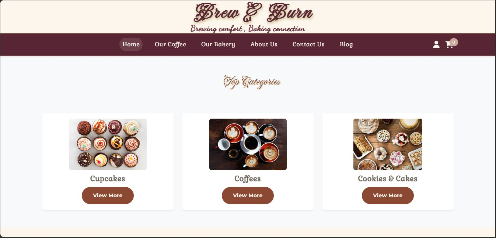
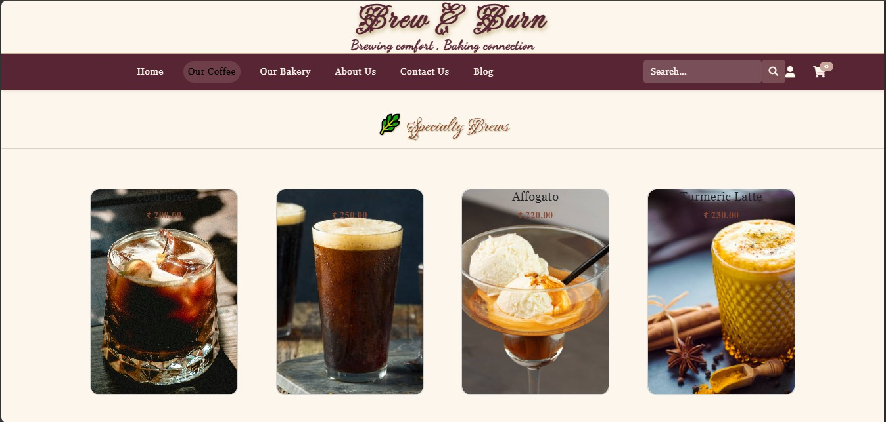
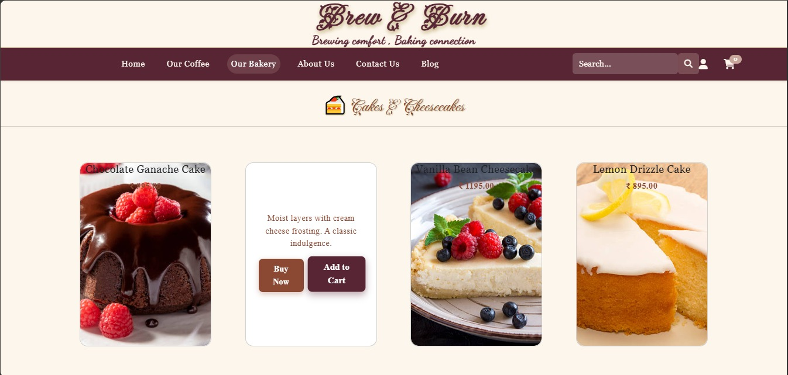
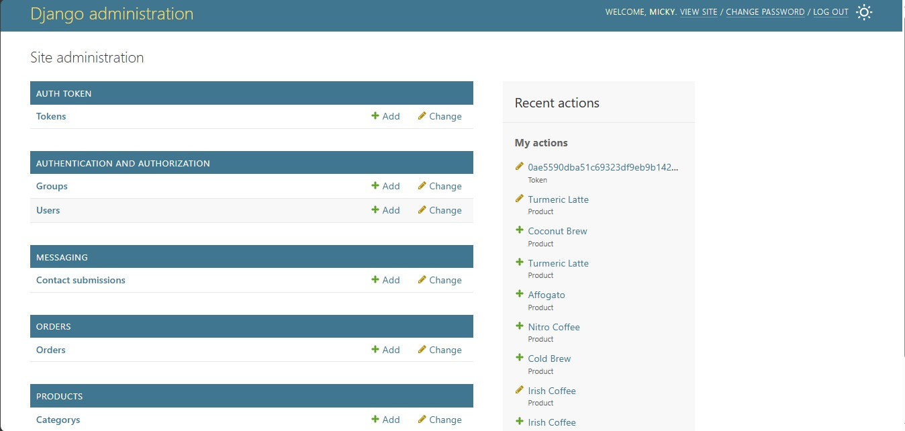

# ☕ Brew and Burn

A full-stack web application for a modern cafe, featuring a responsive user interface and a robust Django backend architecture.

## 📸 Project Showcase

### Customer Interface





### Backend Administration



## 🛠️ Tech Stack

- **Frontend:** HTML, CSS, JavaScript
- **Backend:** Python, Django

## ✨ Key Features

### 🛍️ Customer Experience (Frontend)

- **Responsive Product Catalog:** Beautifully structured menus dividing offerings into distinct categories (Top Categories, Specialty Brews, and Cakes & Cheesecakes).
- **Dynamic Shopping Cart:** Users can seamlessly select items, click "Add to Cart," and view their active selections via a dynamic cart counter in the navigation bar.
- **Modern UI/UX:** A warm, cafe-themed aesthetic utilizing clean HTML/CSS with intuitive navigation links (Home, Our Coffee, Our Bakery, Blog, Contact Us).

### ⚙️ Backend Operations (Django Admin)

- **Secure Authentication & Authorization:** Robust user management featuring groups, specific user permissions, and secure token generation.
- **Order & Inventory Management:** Full CRUD (Create, Read, Update, Delete) capabilities for staff to manage product listings, categories, and incoming customer orders.
- **Messaging System:** Dedicated backend tracking for contact submissions and customer inquiries.

## 🚀 How to Run Locally

### Prerequisites

Ensure you have Python installed on your machine.

### Installation

1. Clone the repository:
   ```bash
   git clone [https://github.com/CodeAlchemistt/brew-and-burn-cafe.git](https://github.com/CodeAlchemistt/brew-and-burn-cafe.git)
   ```
2. Navigate to the backend and start the server:

   bash
   cd backend
   python manage.py runserver

3. Open the frontend:

   bash
   cd frontend
   Open index.html in your browser
